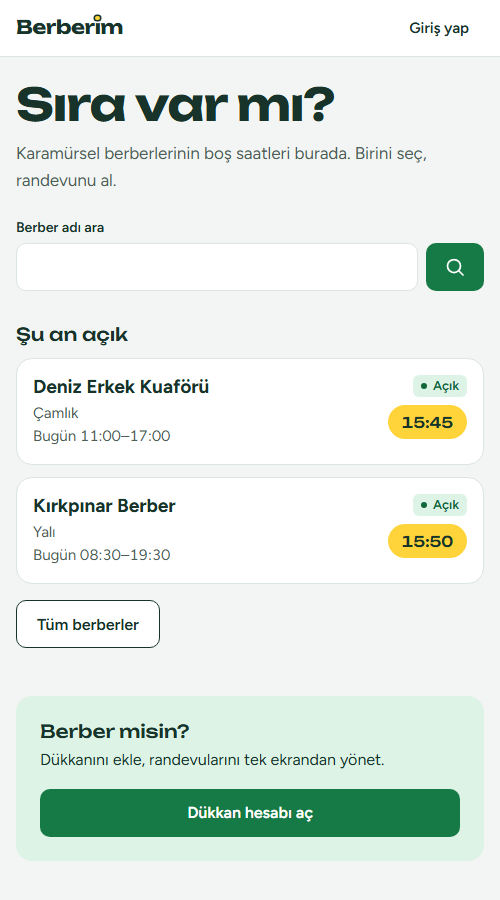
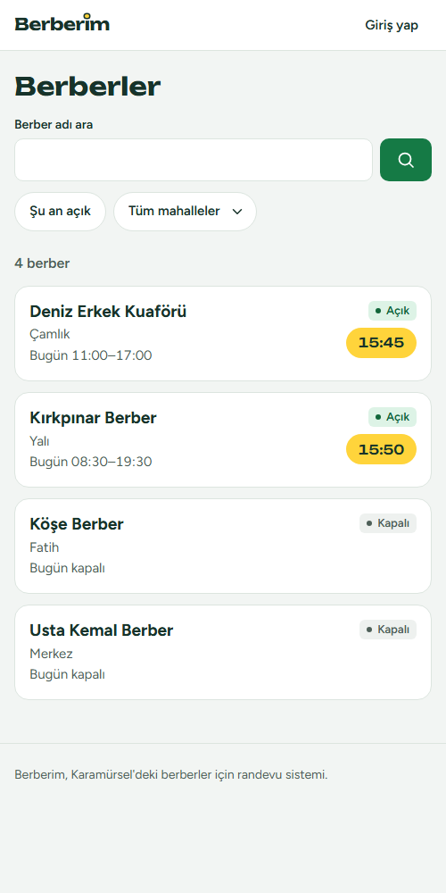
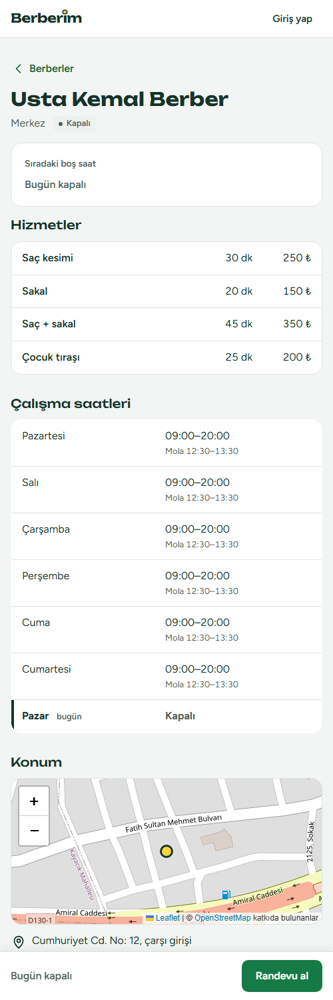
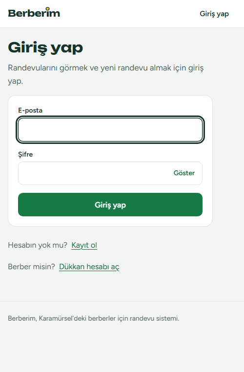
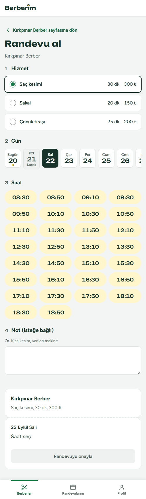
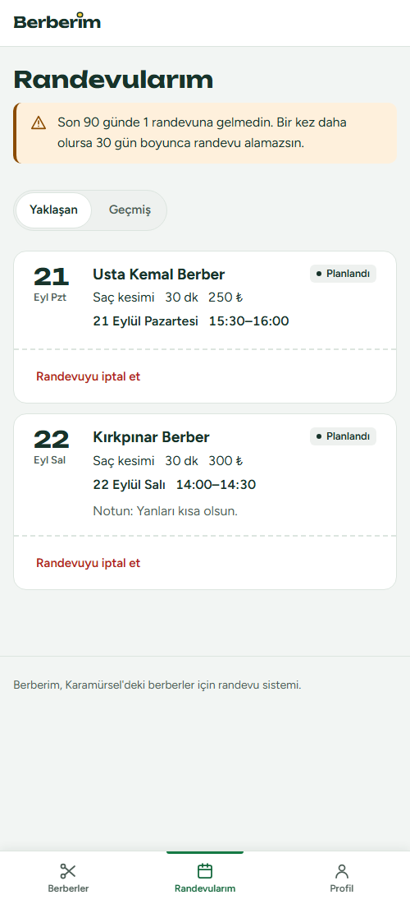
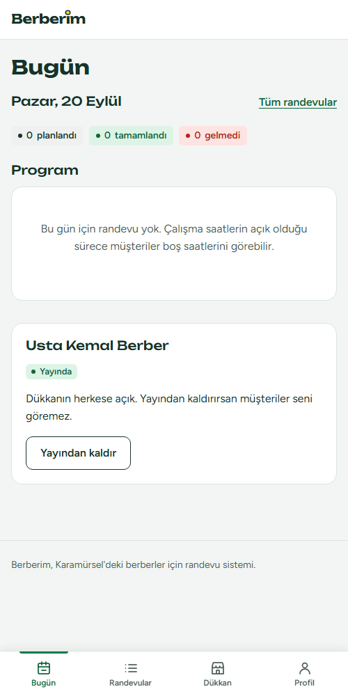
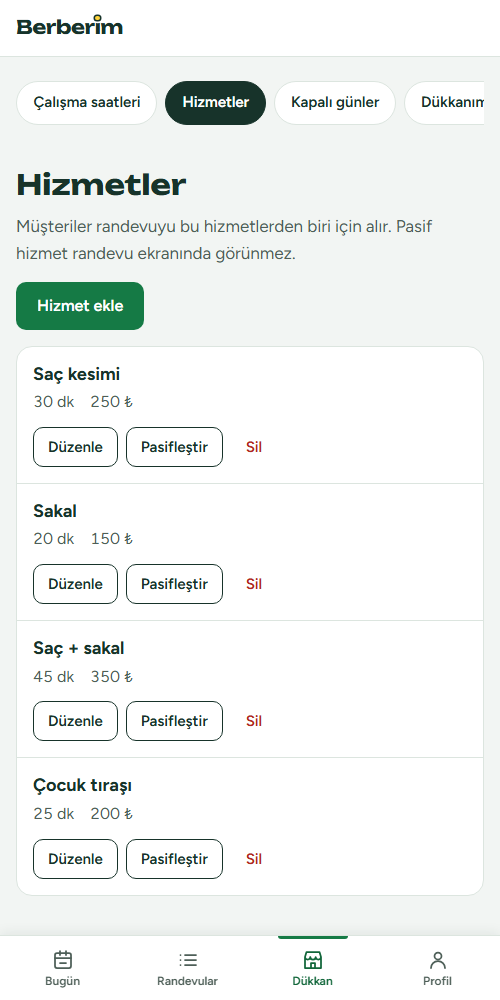
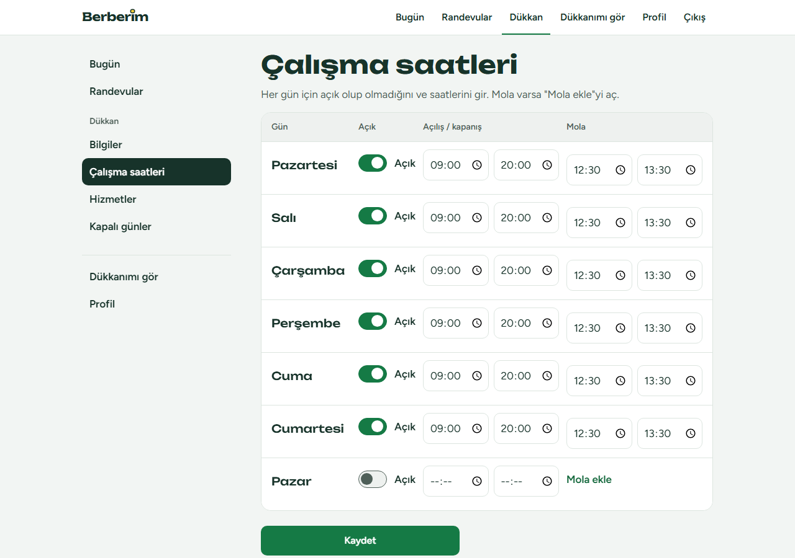
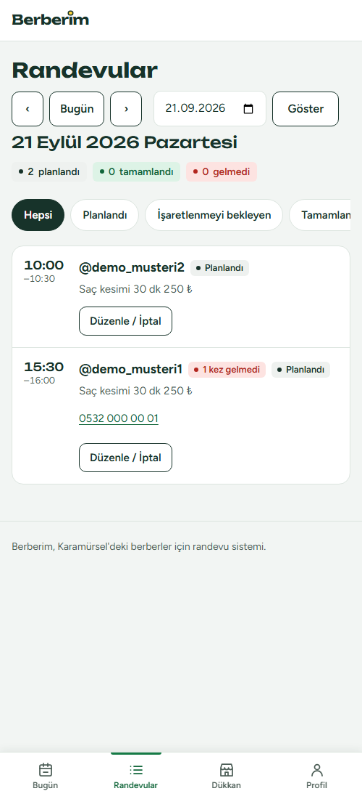

# 11 Kullanıcı kılavuzu

Bu kılavuz Berberim'i **kullananlar** içindir: randevu alan müşteriler ve dükkanını yöneten berberler. Teknik bilgi gerekmez. Ekran görüntüleri demo verisiyle alınmıştır (dükkan adları, isimler ve telefonlar hayalidir).

**Bölümler:** [Ziyaretçi ve müşteri](#a-ziyaretçi-ve-müşteri) · [Dükkan sahibi](#b-dükkan-sahibi) · [Sık sorulan sorular](#c-sık-sorulan-sorular)

---

# A. Ziyaretçi ve müşteri

## A.1 Berberleri bulmak (hesap gerekmez)

Ana sayfada **"Sıra var mı?"** sorusunun altında iki şey görürsün: berber adıyla arama kutusu ve **"Şu an açık"** bölümü. Şu an açık olan berberler, bugünkü çalışma saatleri ve **ilk boş saat** (sarı hap) ile listelenir.

**Tüm berberler** düğmesi ya da menüdeki **Berberler** seni liste sayfasına götürür. Orada:

- **Berber adı ara** kutusuna adı (ya da bir parçasını) yaz; büyük/küçük harf ve Türkçe harf farkı önemli değildir ("kirkpinar" yazsan da "Kırkpınar Berber" bulunur).
- **Mahalle** seçerek listeyi daraltabilirsin.
- **Şu an açık** seçeneği yalnızca şu anda açık olan dükkanları gösterir.

Her satırda dükkanın adı, mahallesi, bugünkü saatleri, **Açık/Kapalı** durumu ve bugün alınabilecek ilk boş saat görünür. Bugün boş saat kalmadıysa hap yerine **"Bugün dolu"** yazar.

## A.2 Dükkanı incelemek

Bir dükkanın adına dokununca detay sayfası açılır: hizmetler (süre ve, dükkan gösteriyorsa, fiyat), haftalık çalışma saatleri, yaklaşan kapalı günler, harita ve adres. **Randevu al** düğmesi hemen orada durur.

## A.3 Hesap açmak ve giriş yapmak

Randevu almak için müşteri hesabı gerekir.

1. **Randevu al** düğmesine bas; giriş yapmadıysan giriş sayfası açılır. Oradaki **Kayıt ol** bağlantısı hesap açma sayfasına götürür (yönlendirme seni unutmaz; hesabı açınca doğrudan randevu sayfasına dönersin).
2. **Kullanıcı adı** (3–20 karakter; küçük harf, rakam, alt çizgi `_` ve nokta), **E-posta**, **Şifre** ve **Şifre (tekrar)** alanlarını doldur. **Telefon** isteğe bağlıdır; yalnızca randevu aldığın dükkanın sahibi görür.
3. **Kayıt ol**'a bas. Hesabın hazırdır ve giriş yapmış olursun.

Sonraki girişlerde **e-posta ve şifrenle** **Giriş yap**. Şifre alanındaki **Göster** düğmesi yazdığını görmeni sağlar. Şifren en az 8 karakter olmalı; çok yaygın ya da yalnızca rakamdan oluşan şifreler kabul edilmez.

> **Berber misin?** "Dükkan hesabı aç" bağlantısı dükkan sahibi kaydına götürür (bkz. B bölümü).

## A.4 Randevu almak

Dükkanın **Randevu al** düğmesi dört adımlı bir sayfa açar:

1. **Hizmet:** Yapılacak işi seç (süre ve fiyat yanında yazar).
2. **Gün:** Gün çiplerinden birini seç. Bugünün altında küçük bir sarı nokta durur; dükkanın kapalı olduğu günler soluk görünür ve seçilemez (**Kapalı** yazar).
3. **Saat:** Seçtiğin hizmet ve gün için **boş saatler** sarı haplar olarak gelir; birine dokun.
4. **Not (isteğe bağlı):** Berbere iletmek istediğin bir şey varsa yaz (en fazla 200 karakter).

Sayfanın altındaki **randevu fişi** seçimini gösterir: dükkan, hizmet, gün ve saat aralığı. Her şey seçilince **Randevuyu onayla** düğmesi etkinleşir (telefonda ekranın altında da beliren bir düğme vardır).

Onaylayınca **Randevularım** sayfasına geçilir ve yeni randevun vurgulanır.

**Kurallar (karşına çıkabilecek durumlar):**

| Durum | Ne yapmalı |
|---|---|
| Saat listesi boş ("Bu gün için boş saat kalmadı") | Başka bir gün seç |
| "Bu saat az önce doldu" | Aynı anda biri seni geçti; listeden başka bir saat seç |
| "Bu berberde en fazla 1 yaklaşan randevun olabilir" | Aynı dükkanda aynı anda tek yaklaşan randevu alınabilir; önce mevcut randevuyu iptal et |
| "En fazla 3 yaklaşan randevun olabilir" | Tüm dükkanlarda toplam 3 yaklaşan randevu sınırı var |
| "Aynı saatte başka bir berberde randevun var" | Çakışmayan bir saat seç |
| En erken saat | Şimdiden en az 30 dakika sonrası için randevu alınabilir |

## A.5 Randevularım: takip ve iptal

**Randevularım** iki bölümden oluşur: **Yaklaşan** ve **Geçmiş** (telefonda üstteki anahtarla geçilir). Her kartta tarih, dükkan, hizmet, saat ve durum rozeti görünür.

**Durum rozetleri:** *Planlandı*, *Tamamlandı*, *Gelmedi*, *İptal edildi*. Dükkan sahibi randevunu iptal ederse kartta "Dükkan iptal etti: ..." ile **sebebi** yazar.

**Randevuyu iptal etmek:** yaklaşan randevu kartındaki **Randevuyu iptal et** düğmesine bas ve onayla. İptal, randevu saatine **en az 1 saat** varken yapılabilir. Süre geçtiyse düğme yerine "Randevuna 1 saatten az kaldı. İptal için dükkanı ara" notu ve dükkanın telefonu görünür; iptal için dükkanı aramalısın.

## A.6 "Gelmedi" uyarısı ve kısıtlama

Randevuna gelmediğinde dükkan sahibi bunu *Gelmedi* olarak işaretler. Kural, herkes için adildir ve tüm dükkanlarda ortaktır:

- Son 90 günde **1** Gelmedi: sayfanın üstünde bir **uyarı** görürsün ("Bir kez daha olursa 30 gün boyunca randevu alamazsın"). Randevu almaya devam edebilirsin.
- Son 90 günde **2** Gelmedi: son Gelmedi'den itibaren **30 gün** yeni randevu alamazsın; kutuda hangi tarihe kadar olduğu yazar.
- Dükkan sahibi bir işareti düzeltirse (ör. aslında geldiysen) kısıt kendiliğinden kalkar.

Randevuna gelemeyeceksen **önceden iptal et**; iptal edilen randevu Gelmedi sayılmaz.

## A.7 Profil ve çıkış

**Profil** sayfasında kullanıcı adını ve telefonunu değiştirebilirsin (e-posta ve rol değişmez). **Çıkış yap** düğmesi de bu sayfadadır (bilgisayarda ayrıca menüde **Çıkış** vardır).

---

# B. Dükkan sahibi

## B.1 Hesap açmak ve dükkanı kurmak

1. Ana sayfadaki **Dükkan hesabı aç** düğmesiyle sahip hesabı aç (alanlar müşteri kaydıyla aynıdır).
2. Girişten sonra panelde **"Dükkanını kur"** formu açılır. Bölümler: **Dükkan** (ad, açıklama), **İletişim** (telefon, mahalle, adres tarifi), **Konum** (isteğe bağlı; haritada dükkanının yerine dokun, işaretçiyi sürükleyebilirsin) ve **Randevu ayarları** (saat aralığı 15/20/30 dk, kaç gün ilerisine randevu alınabileceği 7/14/30 gün, fiyatların vitrinde gösterilip gösterilmeyeceği).
3. **Dükkanı oluştur**'a bas. Dükkan, Pazartesi–Cumartesi 09:00–20:00 açık (Pazar kapalı) varsayılan saatlerle oluşur.

## B.2 Panelde gezinmek

Telefonda alt çubuktan, bilgisayarda soldaki menüden gezinirsin:

| Sekme | Ne için |
|---|---|
| **Bugün** | Günün özeti: sayaçlar, işaretlenmeyi bekleyenler, bugünün programı, kurulum listesi |
| **Randevular** | Herhangi bir günün randevuları ve süzgeçleri |
| **Dükkan** | Bilgiler, çalışma saatleri, hizmetler, kapalı günler, "Dükkanımı gör" |
| **Profil** | Kullanıcı adı, telefon, çıkış |

## B.3 Kurulumu tamamlamak ve yayına almak

**Bugün** sayfasındaki **Kurulum** listesi eksikleri gösterir: dükkan bilgileri, çalışma saatleri, en az bir aktif hizmet (konum isteğe bağlıdır). Eksik maddenin yanındaki **Tamamla** bağlantısı ilgili sayfaya götürür.

Hepsi tamamlanınca **Yayına al** düğmesi etkinleşir. Yayındaki dükkan herkese açık listede görünür; **Yayından kaldır** ile geri çekebilirsin. Yayında olmayan dükkanı yalnızca sen önizleyebilirsin.

### Hizmetler

**Dükkan → Hizmetler → Hizmet ekle**: ad, süre (10–180 dakika, 5'in katı) ve isteğe bağlı fiyat gir. Fiyatı boş bırakırsan müşteri "Fiyat dükkanda" görür. Bir hizmeti **Pasifleştir**ebilirsin (müşteri randevu ekranında görmez); **Sil** yalnızca hiç randevusu olmayan hizmet için çalışır, randevusu olan hizmeti pasifleştirmelisin.

### Çalışma saatleri

**Dükkan → Çalışma saatleri**: her gün için **Açık** anahtarını, açılış ve kapanış saatini gir. Öğle arası varsa **Mola ekle**'yi aç ve mola başlangıç/bitişini yaz. Mola ve kapanış saatleri tutarlı olmalıdır (kapanış açılıştan sonra, mola bu aralığın içinde). Bilgisayarda gün satırları tek tabloda görünür.

### Kapalı günler

**Dükkan → Kapalı günler**: bayram ya da izin gününü ve isteğe bağlı notu ekle. O güne **planlı randevu** varsa gün eklenemez; önce o günün randevularını iptal etmelisin. Yanlış eklediğini **Kaldır** ile silersin.

## B.4 Günlük çalışma: randevuları yönetmek

**Bugün** sayfasında önce **işaretlenmeyi bekleyenler** (saati geçmiş ama henüz *Tamamlandı* ya da *Gelmedi* denmemiş randevular), sonra **Program** yer alır. **Randevular** sekmesinde günler arasında gezer (‹ Bugün ›), tarih seçer ve **çiplerle** süzersin: Hepsi, Planlandı, İşaretlenmeyi bekleyen, Tamamlandı, Gelmedi, İptal edildi.

Her satırda saat, müşterinin kullanıcı adı, hizmet, süre, fiyat, müşterinin telefonu (varsa) ve notları görünür. Müşterinin son 90 günde başka randevularına gelmediği durumlar **"N kez gelmedi"** rozetiyle işaretlenir; müşterinin e-postası hiçbir yerde görünmez.

**İşaretleme:**

| Düğme | Ne zaman görünür | Anlamı |
|---|---|---|
| **Tamamlandı** | Randevu saatine 30 dakika kala ve sonrası | Müşteri geldi |
| **Gelmedi** | Randevu saati geldikten sonra | Müşteri gelmedi (Gelmedi kuralını besler) |
| **İşareti kaldır** | İşaretlenmiş randevuda, 7 gün içinde | İşareti geri alır (Planlandı'ya döner) |

Yanlış işaretledin mi? Randevu gününden sonra **7 gün** içinde işareti değiştirebilir ya da kaldırabilirsin.

**Düzenle / İptal** düğmesi randevu detayını açar:

- **Randevuyu düzenle:** hizmeti ya da günü seç, **boş saatlerden** yenisini seç, gerekirse yalnızca sana özel **dükkan notunu** yaz ve **Değişiklikleri kaydet**. Müşteri değişikliği Randevularım'da görür (ayrıca bildirim gitmez, gerekirse müşteriyi ara).
- **Randevuyu iptal et:** iptal **sebebini** yazman zorunludur; müşteri sebebi Randevularım'da görür. Yalnızca başlamamış randevu iptal edilebilir.

## B.5 İpuçları

- Kurulumu tamamladıktan sonra hizmetlerin hepsini pasifleştirirsen dükkanın yayında kalır ama müşteriler randevu alamaz; **Bugün** sayfası bu durumu uyarıyla gösterir.
- Sık bayram/izin günlerini önceden **Kapalı günler**'e ekle; müşteriler o gün randevu alamaz.
- Telefonla gelen müşteriler için panelden randevu ekleme henüz yoktur; o saati boş bırakırsan başkası alabilir. Müşteriyi uygulamadan randevu almaya yönlendirmek en güvenlisidir.

---

# C. Sık sorulan sorular

**Şifremi unuttum, ne yapmalıyım?** Şifre sıfırlama henüz yoktur. Site yöneticisiyle iletişime geç; yönetici hesabına yardımcı olabilir.

**E-posta adresimi değiştirebilir miyim?** Şimdilik hayır; profilden yalnızca kullanıcı adı ve telefon değişir.

**Telefonumu kim görür?** Yalnızca randevu aldığın dükkanın sahibi (ve site yöneticisi). Telefon isteğe bağlıdır.

**Randevu hatırlatması (SMS/e-posta) gelir mi?** Hayır. Şimdilik bildirim yoktur; randevularını **Randevularım**'dan takip et.

**Randevuma 1 saatten az kaldı, iptal edemiyorum.** Kartta görünen numaradan dükkanı ara; dükkan sahibi randevunu kendisi iptal edebilir.

**Sahip randevumu iptal etti, nedenini nereden görürüm?** Randevularım'da ilgili kartta "iptal edildi" rozetinin yanında sebep yazar.

**Neden randevu alamıyorum?** Sayfanın üstündeki kutu nedeni söyler: Gelmedi kısıtı, randevu limiti ("en fazla 1 yaklaşan randevu" ya da toplam 3) ya da dükkanın şu an randevu almaması.

**Bir dükkanı listede göremiyorum.** Dükkan henüz yayında olmayabilir; yalnızca kurulumu tamamlayıp **Yayına al**'an dükkanlar görünür.
